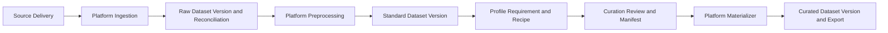
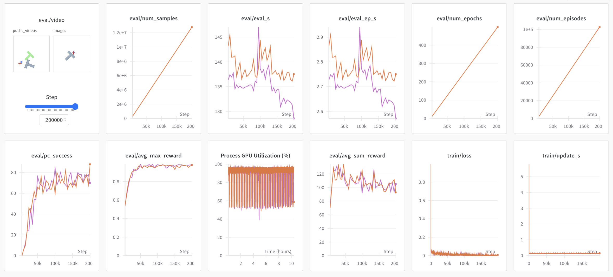

<p align="center">
  <picture>
    <source media="(prefers-color-scheme: dark)" srcset="media/lerobot-logo-thumbnail.png">
    <source media="(prefers-color-scheme: light)" srcset="media/lerobot-logo-thumbnail.png">
    
  </picture>
  <br/>
  <br/>
</p>

<div align="center">

[](https://github.com/huggingface/lerobot/actions/workflows/nightly-tests.yml?query=branch%3Amain)
[](https://codecov.io/gh/huggingface/lerobot)
[](https://www.python.org/downloads/)
[](https://github.com/huggingface/lerobot/blob/main/LICENSE)
[](https://pypi.org/project/lerobot/)
[](https://pypi.org/project/lerobot/)
[](https://github.com/huggingface/lerobot/tree/main/examples)
[](https://github.com/huggingface/lerobot/blob/main/CODE_OF_CONDUCT.md)
[](https://discord.gg/s3KuuzsPFb)

</div>

<br/>

<h3 align="center">
    <p>LeRobot: State-of-the-art AI for real-world robotics</p>
</h3>

---

🤗 LeRobot aims to provide models, datasets, and tools for real-world robotics in PyTorch. The goal is to lower the barrier to entry to robotics so that everyone can contribute and benefit from sharing datasets and pretrained models.

🤗 LeRobot contains state-of-the-art approaches that have been shown to transfer to the real-world with a focus on imitation learning and reinforcement learning.

🤗 LeRobot already provides a set of pretrained models, datasets with human collected demonstrations, and simulation environments to get started without assembling a robot. In the coming weeks, the plan is to add more and more support for real-world robotics on the most affordable and capable robots out there.

🤗 LeRobot hosts pretrained models and datasets on this Hugging Face community page: [huggingface.co/lerobot](https://huggingface.co/lerobot)

## Local Data Platform

**开发／生产双环境：** 新部署使用显式 `--env dev|prod`，开发验证后将同一份版本包发布到生产。
首次初始化、角色切换、升级和回退请按 [双环境部署指南](docs/data_platform_environments.md) 操作。
账号统一使用 username；改密和管理员重置流程见 [账号与密码恢复](docs/data_platform_accounts.md)。


Task definitions are configurable in the console. Existing Pick/Place/Give tasks and new task families share versioned catalogs, dataset mappings, analysis and curation filters, and portable Agent configuration snapshots. See the [task onboarding guide](docs/data_platform_task_catalog.md).

### Run Analysis without preparing caches

Select a dataset and open **Explore → Dataset Analysis → Open analysis**. **Refresh analysis**
runs analysis directly; neither action starts Prepare cache or a remote preparation job.
Tasks, attributes, episode counts, frame counts, and durations come from dataset metadata.
Duration is episode length divided by FPS. Existing CSV files optionally supply stage and
object-presence distributions; missing optional files are shown as **Not generated**, not review flags.

Remote Analysis uses the latest metadata synced by the Agent, even when no Viewer cache exists or
the Agent is offline. The page shows the report's sync time. Update Server A first, then update the
Agent and wait for its automatic metadata sync to include episode lengths (`analysis_metadata_version=1`). Older reports
still provide known totals and task distributions; unavailable per-episode values remain empty.
Preparing videos is only needed when you want to use the Viewer. Analysis does not modify source data.

### Shared Qwen API key on Server A

Task suggestions, Qwen API object labeling, and VLM auto-tagging use the same server-side
`DASHSCOPE_API_KEY`. Configure it once in the deployed service environment:

```bash
sudoedit /etc/data-platform/server.env
```

Add or update these entries in that file (replace the key placeholder there):

```ini
DASHSCOPE_API_KEY=YOUR_QWEN_API_KEY
DASHSCOPE_BASE_URL=https://dashscope.aliyuncs.com/compatible-mode/v1
DATA_PLATFORM_TASK_MODEL=qwen3.6-plus
```

Keep the endpoint in the same region as your key. `DATA_PLATFORM_TASK_MODEL` only controls task
suggestions; image labeling and tagging retain their own model selectors. Save the file, then run:

```bash
sudo chmod 640 /etc/data-platform/server.env
sudo systemctl restart data-platform-web
sudo systemctl status data-platform-web --no-pager -l
```

For a code update, run `data-platform-update-all --env prod --release RELEASE` after development acceptance, following the deployment
workflow below. That updater preserves the environment file. This Qwen feature runs on Server A
and does not require another Agent upgrade or distributing the API key to Agents.

In **Task setup**, load instructions, select the latest catalog, and click **Suggest with AI**.
Review the proposed tasks, select the ones to keep, then click **Save selected & preview → Apply
to dataset**. Suggestions use unique instruction texts and the catalog; generating and reviewing
them require no Prepare cache. Saving suggestions creates a catalog version, while **Apply to
dataset** remains the explicit mapping update and background CSV refresh.

In **Auto labeling** and **Auto-tagging**, choose the Qwen API backend and leave the API key field
empty to use the shared key. Explicit keys still override it. A custom endpoint requires its own
explicit key (or `EMPTY` for a local unauthenticated server), unless it is configured centrally with
`DASHSCOPE_BASE_URL`. The Qwen Gradio backend retains its separate ModelScope token.
The browser receives only whether the shared key is configured. Keep the real key out of source
files and shell command arguments. See the [task setup guide](docs/data_platform_task_catalog.md#ai-assisted-task-setup).

### Start the web console

The Data Platform is included with LeRobot and does not require a separate installation. Before
starting it, install this repository by following the [Installation](#installation) instructions
below.

Start the platform with a directory containing one or more local datasets:

```bash
python -m lerobot.data_platform --root /path/to/datasets
```

The home page recursively discovers directories containing `meta/info.json` and exposes two
logical workspaces in the same process:

- **Data Platform** is the supply and execution plane for ingestion, preprocessing, immutable
  dataset versions, lineage, and materialization.
- **Data Curation** is the decision plane for exploration, quality review, annotation, cohort
  selection, profiling, versioned requirements/recipes, and dataset construction.

The two workspaces continue to share the dataset selector, Viewer, Job & Artifacts panel, and
operation audit log. The implementation lives in [`lerobot/data_platform`](lerobot/data_platform).
For a central MySQL-backed service with node agents on multiple servers, see the
[distributed deployment guide](docs/distributed_data_platform_deployment.md).

The platform always operates on real LeRobot metadata and trajectory data. It reports invalid
inputs instead of replacing them with fabricated samples. Data Construction also preserves the
source observation and action values; it creates training variants by changing task metadata,
bookkeeping indices, and `exist_label`.

### Platform overview



Published raw, standard, and curated dataset versions are immutable. Stable `episode_uid` values
live in portable Identity Artifacts outside dataset roots; physical copies are registered as
`DatasetReplica` records. Curation edits first live in revision-controlled Workspaces and are
frozen into versioned manifests. Versioned preprocessing/materialization Profiles separate
content-affecting configuration from runtime options. The materializer is idempotent, persists its
state in SQLite, validates row counts, timestamps, metadata, and complete file SHA256 values, then
atomically registers the logical version and output replica.

### Modules and capabilities

| Domain | Main modules | What the UI can do |
| --- | --- | --- |
| Platform — ingestion and versions | `lifecycle.py`, `lifecycle_repository.py`, `routes/lifecycle.py` | Full-hash local datasets, register immutable versions/replicas and portable identity artifacts, inspect explicit episode lineage. |
| Platform — delivery and reconciliation | `lifecycle.py`, `routes/lifecycle.py` | Register source deliveries and explain every received/accepted/excluded/repaired/generated Episode transition. |
| Platform — preprocessing and materialization | `precompute/preprocess/`, `lifecycle.py` | Execute versioned Profiles and idempotently materialize a published manifest through a persisted validation state machine. |
| Curation — understand and quality | `viewer.py`, `precompute/analysis.py`, `precompute/compare/`, `precompute/embedding/`, `precompute/preprocess/quality_flags.py` | Explore trajectories, distributions, embeddings, comparisons, technical issues, and semantic quality evidence. |
| Curation — enrichment and selection | `precompute/annotation.py`, `precompute/labeling/`, `precompute/tagging/`, `precompute/construction/` | Edit revision-controlled Workspaces containing stage, prompt, bbox, tag, include/exclude, trim, and value-edit decisions before publishing a manifest. |
| Curation — profile and recipe | `lifecycle.py`, `routes/lifecycle.py` | Publish Dataset Profiles and Requirements, resolve fixed cohorts, and compile deterministic Recipes into reviewable Workspaces. |

The data-processing area is divided into smaller modules:

| Processing module | Capabilities |
| --- | --- |
| Feature conversion (`action_dim.py`, `field_ops.py`) | Trim action/state vectors to a target dimension and remove selected fields from parquet data and feature metadata. |
| Signal processing (`smooth_action.py`) | Apply centered temporal smoothing to action values and, when requested, state values. |
| Dataset standardization (`standardize.py`) | Run the platform's combined cleanup pipeline: normalize DVT2 grippers, align action/state dimensions, remove depth fields, write stage/subtask data, and repair indices. |
| Dataset composition (`dataset_split.py`, `dataset_merge.py`, `dataset_subtract.py`) | Create task/episode subsets, combine datasets with remapped metadata, or remove episodes that exactly match episodes in other datasets. |
| Quality and metadata repair (`quality_flags.py`, `flag_fixes.py`, `flag_clear.py`, `prompt_rewrite.py`) | Detect data-quality problems, apply supported repairs, review task/prompt assignments, and clear resolved flags. |
| Episode maintenance (`delete_episodes.py`) | Delete selected episodes in place, reindex the remaining data and metadata, and attempt rollback if the operation fails. |

Dataset merge defaults to strict signal schemas and dimension order. Use
`--preprocess-merge-dimension-policy min` (or **Signal dimensions → Minimum** in the Merge page)
to align each action/state field to the smallest source layout by complete, unique dimension names.
Missing dimensions or incompatible robot semantics/units are rejected. Dry run reports the mappings
and dropped dimensions; execution writes a new dataset and rebuilds its signal statistics and CSV cache.
The same Merge form supports multiple datasets on one Agent after Server A and that Agent are updated.
Remote merge validates registered location IDs and path boundaries, then uploads the new Viewer cache
and registers the output. Cross-Agent merging is not supported.

The default console path does not expose direct source-dataset mutation controls. Cache,
analysis, Workspaces, manifests, and lifecycle records live outside the source dataset; preprocessing
and materialization create sibling outputs. The normal startup command also provides a password-
protected Admin Mode in the browser. On first entry, set the local administrator password for that
dataset root; later entries require the same password. The password is stored only as a salted hash,
and Admin Mode remains active until explicitly exited or the browser session ends. Episode deletion
requires an impact confirmation and a reason recorded in the operation audit log.

To mark one or more read-only source zones at startup, repeat `--protected-source-root`. The console
also exposes the same policy on the Datasets page. Protected datasets can be reviewed and used to
create sibling outputs, but every legacy in-place delete, repair, or overwrite request is rejected.

```bash
python -m lerobot.data_platform \
  --root /path/to/datasets \
  --protected-source-root /path/to/raw_data
```

Admin Mode can modify or delete source Parquet, videos, and metadata and should not be used for
normal curation work.

When `DATA_PLATFORM_DATABASE_URL` enables the central multi-user service, the central `admin` role
replaces this separate local Admin Mode login. Administrators receive admin controls immediately
after signing in. Self-registered accounts remain pending until an administrator approves them;
approved accounts start as read-only `viewer` users with no delete permission.

See [`docs/data_lifecycle_architecture.md`](docs/data_lifecycle_architecture.md) for the capability
matrix, persisted contracts, API mapping, lifecycle states, and materialization invariants.

## 中央服务器日常运维（Server A）

本节记录当前中央 Data Platform 的启动、更新、检查和故障排查命令。更完整的首次安装与
节点接入流程见 [`docs/distributed_data_platform_deployment.md`](docs/distributed_data_platform_deployment.md)。

### 服务与访问入口

以下端口和单环境路径用于识别已有部署；新建与升级双环境请以 [双环境部署指南](docs/data_platform_environments.md) 为准。

当前 Server A 使用以下 systemd 服务：

| 服务 | 作用 | 正常状态 |
| --- | --- | --- |
| `mysql` | 保存网页用户、会话、节点、数据位置及远程任务 | `active` |
| `data-platform-web` | Gunicorn 中央网页服务，仅监听 `127.0.0.1:9091` | `active` |
| `nginx` | 对浏览器提供 HTTP/HTTPS，并转发到 Gunicorn | `active` |
| `data-platform-h100-tunnel` | 保持 Server A 到远程数据节点的反向 SSH 隧道 | `active` |

查看当前 `10.8` 网段地址：

```bash
hostname -I | tr ' ' '\n' | grep '^10\.8\.'
```

浏览器入口为：

```text
https://<当前的 10.8.x.x 地址>/
```

登录页和节点/用户管理页分别为：

```text
https://<当前的 10.8.x.x 地址>/login
https://<当前的 10.8.x.x 地址>/control-plane
```

当前使用自签名证书，未安装该证书的浏览器可能显示安全提示。不要从其他电脑直接访问
`9091`；该端口只供 Server A 本机的 Nginx 使用。

### Server A 重启之后

四个服务均设置为开机自启，正常情况下服务器重启后不需要手动启动。等待约 30 秒后检查：

```bash
systemctl is-active mysql data-platform-web nginx data-platform-h100-tunnel
```

应依次得到四行 `active`。再检查中央应用：

```bash
curl http://127.0.0.1:9091/healthz
```

正常响应为：

```json
{"control_plane":true,"status":"ok"}
```

检查 Nginx HTTPS 入口（仅用于本机健康检查，因此忽略自签名证书校验）：

```bash
curl -k https://127.0.0.1/healthz
```

首次执行下面的动态 IP 配置后，Nginx 不再绑定具体 IP，反向隧道也只连接
`127.0.0.1:443`。Server A 地址变化不会影响服务和 H100-05 Agent 自动恢复；没有稳定域名时，
浏览器仍需改用上面查到的新 IP。Nginx 只允许 Server A 本机和公司 `10.8.0.0/16` 网段访问。

```bash
cd /home/yuhao.song/Codes/data_platform
bash deploy/data-platform/environment.sh network --env dev
```

新网络命令仅配置所选环境，Nginx 校验失败时恢复原配置；安装日常命令使用
`sudo bash deploy/data-platform/install-commands.sh`。首次生产接入使用双环境指南中的 `adopt-legacy`。

### 固定更新流程（开发验收 → 生产发布）

先按 [双环境部署指南](docs/data_platform_environments.md) 完成初始化及现有生产环境接入。
候选版本来自已提交且干净的源码；开发、生产安装相同的 Server/Agent 包。部署仍先更新 Server A，
再逐个升级所选环境的 Agent。开发和生产有独立的服务、MySQL 库、Lifecycle 状态、缓存及节点身份。

```bash
data-platform-update-all --env dev --version RELEASE
# 完成人工场景测试后，保存验收结果。
data-platform-release approve --env dev --release RELEASE --evidence /PATH/TO/evidence.json
data-platform-update-all --env prod --release RELEASE
```

命令需要本机 sudo；SSH 使用发起者身份。Server 的依赖同步保持 `--frozen`，先离线、再在线，
可追加 `--index-url https://pypi.tuna.tsinghua.edu.cn/simple`。常规生产更新使用已经验收的安装包，不重新构建。

保留两个环境一起硬升级的入口（两套环境需已初始化并接入新部署流程）：

```bash
data-platform-update-all --env both --hard --version RELEASE
# 已构建同名包时，使用 --release RELEASE 重用它。
```

该命令构建一次，依次更新开发和生产的 Server 与 Agent，跳过人工开发验收，保留测试、环境隔离、备份及
健康检查。任一步失败即停止；已经成功更新的环境保留新版本。详细流程见
[双环境部署文档](docs/data_platform_environments.md#开发和生产一起硬升级)。
Agent 包保留在源码的 `dist/agent/`，发行清单与校验记录位于 `/var/lib/data-platform-releases/`。

单独更新 Server 使用 `data-platform-update --env prod --release RELEASE`，完成后保持维护，
匹配 Agent 也验证通过后再恢复。服务状态、版本/环境检查和 Agent 心跳全部通过才算完成。
失败后保留维护状态、备份和上传现场；检查 `data-platform-release status --env prod` 后修复或回退。


### 手动启动、停止和重启

只重启网页服务：

```bash
sudo systemctl restart data-platform-web
```

一次重启所有中央服务和隧道：

```bash
data-platform-restart --env prod
```

查看完整状态：

```bash
sudo systemctl status mysql data-platform-web nginx data-platform-h100-tunnel --no-pager -l
```

手动停止或启动网页服务：

```bash
sudo systemctl stop data-platform-web
sudo systemctl start data-platform-web
```

服务刚重启时 Gunicorn worker 可能尚未加载完成。此时 `systemctl status` 已显示 `running`，但
立即执行 `curl` 仍可能暂时得到 `Connection refused`；等待几秒后重试即可。

### 查看日志

持续查看网页服务日志：

```bash
sudo journalctl -u data-platform-web -f
```

查看最近 100 行网页服务日志：

```bash
sudo journalctl -u data-platform-web -n 100 --no-pager -l
```

查看反向隧道日志：

```bash
sudo journalctl -u data-platform-h100-tunnel -n 100 --no-pager -l
```

查看 Nginx 日志：

```bash
sudo tail -f /var/log/nginx/access.log /var/log/nginx/error.log
```

查看 MySQL 日志：

```bash
sudo journalctl -u mysql -n 100 --no-pager -l
```

### 更新失败：MySQL 报 Out of sort memory

如果更新脚本报 `service did not become healthy within 30 seconds`，并且 Gunicorn 日志显示
`list_locations()` 查询触发 MySQL `1038: Out of sort memory`，启动失败发生在中央服务恢复
远程 Viewer 列表时。旧查询同时读取较大的 `metadata_json` 并排序，可能耗尽 MySQL 排序缓冲。
当前代码将排序与元数据读取拆开，保留原来的列表顺序和完整元数据。

先从包含修复的工作区重新部署中央服务：

```bash
(
  set -e
  cd /home/yuhao.song/Codes/data_platform
  data-platform-update-all --env prod --release RELEASE
  curl -fsS http://127.0.0.1:9091/healthz
)
```

等健康检查成功后，再继续前面的 Agent 构建、传输和安装步骤。使用上述带 `set -e` 的更新块时，
中央更新失败会中止后续命令，Agent 包尚未构建或传输。修复此查询不需要修改数据库内容或
提高全局 `sort_buffer_size`；单纯重启服务也不会部署工作区中的修复。

### 用户注册、审批与权限

当 `/etc/data-platform/server.env` 中设置 `DATA_PLATFORM_ALLOW_REGISTRATION=1` 时，用户可以
从登录页申请账号。新账号不会自动登录，必须由 `admin` 在 `/control-plane` 的
“Users and approvals”中审批。

- `viewer`：默认角色，只读，不能修改或删除数据。
- `operator`：可以运行允许的查看准备和衍生预处理任务，不能删除或原地修改。
- `data_manager`：继承 operator 能力；在 admin 授权的数据集位置内，可直接修改源数据、删除指定 episodes，无需申请审批。
- `admin`：管理账号和数据权限，并拥有全局数据管理权限。

管理员在 `/control-plane` → “Users & access” 将角色设为 Data manager，再点击 “Data permissions”
勾选允许修改的数据集并保存。默认无授权，新数据集不自动继承；这不授予整目录删除、用户管理、
跨用户任务控制或审批他人删除申请的权限。源数据修改仍需服务端和 Agent 开关、操作确认及文件系统权限。
授权撤销后，未开始的源数据修改任务无法领取；已开始的任务继续走现有执行和恢复流程。

Bootstrap token 只用于数据库中没有任何用户时创建首位管理员。普通登录和注册不需要该
token。不要把 Bootstrap token、Agent enrollment token 或密码写入 README、命令历史或日志。

查看当前网页用户及角色：

```bash
sudo mysql -D data_platform -e "SELECT username, display_name, role, active, created_at FROM dp_users ORDER BY created_at;"
```

查看 MySQL 实际数据目录：

```bash
sudo mysql -Nse "SELECT @@hostname, @@datadir;"
```

不要直接修改 MySQL 数据目录中的文件。配置文件位于 `/etc/data-platform/server.env`，修改后
需要重启网页服务：

```bash
sudo systemctl restart data-platform-web
```

### 远程节点与反向隧道

在 Server A 检查隧道：

```bash
systemctl is-active data-platform-h100-tunnel
sudo systemctl status data-platform-h100-tunnel --no-pager -l
```

在远程数据节点检查中央服务是否能通过本地隧道访问：

```bash
curl --noproxy '*' https://127.0.0.1:9443/healthz
```

在远程数据节点检查 Agent：

```bash
sudo systemctl status data-platform-agent --no-pager -l
sudo journalctl -u data-platform-agent -n 100 --no-pager -l
```

如果节点未出现在 `/control-plane`，依次检查 Server A 的
`data-platform-h100-tunnel`、节点上的 `127.0.0.1:9443/healthz`，最后检查
`data-platform-agent` 日志。Server A 的 `data-platform-update` 不会更新远程 Agent。

`/control-plane` 默认只在 Nodes 表中显示每台 Agent 的数据集数量，不会一次展开全部路径。
点击 **View N datasets** 后可按名称或路径搜索，并按处理中、最近失败或 Viewer 缺失筛选；
数据集列表每页显示 20 条。远程预处理统一从首页 Dataset console 发起。

在首页选择 Agent、扫描路径后，点击数据集卡片上的 **select & preprocess**，即可把该节点的
数据设为 Working dataset。页面顶部的 **Working dataset** 下拉框也同时列出 Server A 与全部
Agent 数据集，切换后 Server 和操作表单会一起更新，刷新页面仍会恢复该选择。

Server A 和 Agent 都使用同一个 **Datasets** 列表，不再向普通用户区分 Registered/Available。
Server A 首次选择数据集时由 Operator 或 Admin 自动完成 Catalog 登记；Agent 的发现结果由节点
同步自动登记。`unregister` 仅 Admin 可用，并且只删除 Catalog 记录，不删除磁盘数据。

Cache、Standardize、Transform、Value Edit 和 Split 使用与 Server A 相同的主要参数。远程 Cache
可选择视频/CSV、profile 和覆盖策略；衍生操作可以留空输出路径以使用安全默认值，也可以填写
Agent 上的绝对路径。自定义路径必须位于该 Agent 配置的 `writable roots` 内，且不能是源数据集、
源数据集的父目录或子目录。Standardize 和 Convert v3 支持显式覆盖已有数据集输出；Standardize
还可以仅从标准化输出中删除指定 episodes。Standardize 完成后会自动生成并上传新数据集的
Viewer cache，无需再单独执行 Prepare viewer。**Jobs** 抽屉和 **Pipeline Runs** 页面使用同一份
任务信息，统一显示服务器、进度、耗时、日志、结果摘要和输出数据集；完成后可直接切换到输出
数据集。输出尚无 Viewer cache 时，Job 卡片可直接启动 **Prepare viewer**，完成后同一位置切换为
**Open viewer**。本地与 Agent 数据集统一进入 **Data Curation**，包含 Explore、Quality、Annotation 和 Dataset Build；
计算在数据所在节点执行，草稿、审核与结果保存在中心服务。详见[统一 Curation 工作流](docs/data_platform_unified_curation.md)。
在 **Explore** 可查看 Episode Viewer；
Dataset Analysis 可直接使用 Agent 上报的元数据，无需先准备 Viewer cache。Embedding、标注和构造入口仍不显示。

远程原地修改默认关闭。确实需要 Admin 执行原地值修改、v3 时间戳修复或 episode 删除时，必须
同时设置：

```bash
# Server A: /etc/data-platform/server.env
DATA_PLATFORM_ENABLE_LEGACY_MUTATIONS=1

# 数据节点: /etc/data-platform/agent.env
DATA_PLATFORM_AGENT_ALLOW_SOURCE_MUTATIONS=1
```

然后分别重启 `data-platform-web` 和 `data-platform-agent`。每次真实写入前，Agent 会在
`<数据集父目录>/.data-platform-backups/<数据集名>/` 下保留持久备份；任务失败会自动恢复，成功
后 Server A 会使旧 Viewer 缓存失效，需重新 Prepare viewer。普通 `operator` 只能生成兄弟数据集，
不能执行这些原地操作。完整安全条件和恢复说明见
[`docs/distributed_data_platform_deployment.md`](docs/distributed_data_platform_deployment.md)。

### 常用路径

| 路径 | 内容 |
| --- | --- |
| `/opt/data-platform` | Server A 当前运行代码与虚拟环境 |
| `/etc/data-platform/server.env` | 中央服务配置和敏感环境变量 |
| `/etc/systemd/system/data-platform-web.service` | 网页服务 unit |
| `/etc/systemd/system/data-platform-h100-tunnel.service` | 反向隧道 unit |
| `/etc/nginx/tls/` | 当前 HTTPS 证书和私钥 |
| `/etc/data-platform/network-backups/` | 动态 IP 改造前的 Nginx 与隧道配置备份 |
| `/srv/data-platform/remote-cache` | 远程节点上传到 Server A 的只读 Viewer 缓存 |


## Installation

Download our source code:
```bash
git clone https://github.com/Beaconsyh08/data_platform.git
cd data_platform
```

Create a virtual environment with Python 3.10 and activate it, e.g. with [`miniconda`](https://docs.anaconda.com/free/miniconda/index.html):
```bash
conda create -y -n lerobot python=3.10
conda activate lerobot
```

When using `miniconda`, install `ffmpeg` in your environment:
```bash
conda install ffmpeg -c conda-forge
```

> **NOTE:** This usually installs `ffmpeg 7.X` for your platform compiled with the `libsvtav1` encoder. If `libsvtav1` is not supported (check supported encoders with `ffmpeg -encoders`), you can:
>  - _[On any platform]_ Explicitly install `ffmpeg 7.X` using:
>  ```bash
>  conda install ffmpeg=7.1.1 -c conda-forge
>  ```
>  - _[On Linux only]_ Install [ffmpeg build dependencies](https://trac.ffmpeg.org/wiki/CompilationGuide/Ubuntu#GettheDependencies) and [compile ffmpeg from source with libsvtav1](https://trac.ffmpeg.org/wiki/CompilationGuide/Ubuntu#libsvtav1), and make sure you use the corresponding ffmpeg binary to your install with `which ffmpeg`.

Install 🤗 LeRobot:
```bash
pip install -e .
```

> **NOTE:** If you encounter build errors, you may need to install additional dependencies (`cmake`, `build-essential`, and `ffmpeg libs`). On Linux, run:
`sudo apt-get install cmake build-essential python3-dev pkg-config libavformat-dev libavcodec-dev libavdevice-dev libavutil-dev libswscale-dev libswresample-dev libavfilter-dev pkg-config`. For other systems, see: [Compiling PyAV](https://pyav.org/docs/develop/overview/installation.html#bring-your-own-ffmpeg)

For simulations, 🤗 LeRobot comes with gymnasium environments that can be installed as extras:
- [aloha](https://github.com/huggingface/gym-aloha)
- [xarm](https://github.com/huggingface/gym-xarm)
- [pusht](https://github.com/huggingface/gym-pusht)

For instance, to install 🤗 LeRobot with aloha and pusht, use:
```bash
pip install -e ".[aloha, pusht]"
```

To use [Weights and Biases](https://docs.wandb.ai/quickstart) for experiment tracking, log in with
```bash
wandb login
```

(note: you will also need to enable WandB in the configuration. See below.)

## Walkthrough

```
.
├── examples             # contains demonstration examples, start here to learn about LeRobot
|   └── advanced         # contains even more examples for those who have mastered the basics
├── lerobot
|   ├── configs          # contains config classes with all options that you can override in the command line
|   ├── common           # contains classes and utilities
|   |   ├── datasets       # various datasets of human demonstrations: aloha, pusht, xarm
|   |   ├── envs           # various sim environments: aloha, pusht, xarm
|   |   ├── policies       # various policies: act, diffusion, tdmpc
|   |   ├── robot_devices  # various real devices: dynamixel motors, opencv cameras, koch robots
|   |   └── utils          # various utilities
|   └── scripts          # contains functions to execute via command line
|       ├── eval.py                 # load policy and evaluate it on an environment
|       ├── train.py                # train a policy via imitation learning and/or reinforcement learning
|       ├── control_robot.py        # teleoperate a real robot, record data, run a policy
|       ├── push_dataset_to_hub.py  # convert your dataset into LeRobot dataset format and upload it to the Hugging Face hub
|       └── visualize_dataset.py    # load a dataset and render its demonstrations
├── outputs               # contains results of scripts execution: logs, videos, model checkpoints
└── tests                 # contains pytest utilities for continuous integration
```

### The `LeRobotDataset` format

A dataset in `LeRobotDataset` format is very simple to use. It can be loaded from a repository on the Hugging Face hub or a local folder simply with e.g. `dataset = LeRobotDataset("lerobot/aloha_static_coffee")` and can be indexed into like any Hugging Face and PyTorch dataset. For instance `dataset[0]` will retrieve a single temporal frame from the dataset containing observation(s) and an action as PyTorch tensors ready to be fed to a model.

A specificity of `LeRobotDataset` is that, rather than retrieving a single frame by its index, we can retrieve several frames based on their temporal relationship with the indexed frame, by setting `delta_timestamps` to a list of relative times with respect to the indexed frame. For example, with `delta_timestamps = {"observation.image": [-1, -0.5, -0.2, 0]}`  one can retrieve, for a given index, 4 frames: 3 "previous" frames 1 second, 0.5 seconds, and 0.2 seconds before the indexed frame, and the indexed frame itself (corresponding to the 0 entry). See example [1_load_lerobot_dataset.py](examples/1_load_lerobot_dataset.py) for more details on `delta_timestamps`.

Under the hood, the `LeRobotDataset` format makes use of several ways to serialize data which can be useful to understand if you plan to work more closely with this format. We tried to make a flexible yet simple dataset format that would cover most type of features and specificities present in reinforcement learning and robotics, in simulation and in real-world, with a focus on cameras and robot states but easily extended to other types of sensory inputs as long as they can be represented by a tensor.

Here are the important details and internal structure organization of a typical `LeRobotDataset` instantiated with `dataset = LeRobotDataset("lerobot/aloha_static_coffee")`. The exact features will change from dataset to dataset but not the main aspects:

```
dataset attributes:
  ├ hf_dataset: a Hugging Face dataset (backed by Arrow/parquet). Typical features example:
  │  ├ observation.images.cam_high (VideoFrame):
  │  │   VideoFrame = {'path': path to a mp4 video, 'timestamp' (float32): timestamp in the video}
  │  ├ observation.state (list of float32): position of an arm joints (for instance)
  │  ... (more observations)
  │  ├ action (list of float32): goal position of an arm joints (for instance)
  │  ├ episode_index (int64): index of the episode for this sample
  │  ├ frame_index (int64): index of the frame for this sample in the episode ; starts at 0 for each episode
  │  ├ timestamp (float32): timestamp in the episode
  │  ├ next.done (bool): indicates the end of an episode ; True for the last frame in each episode
  │  └ index (int64): general index in the whole dataset
  ├ episode_data_index: contains 2 tensors with the start and end indices of each episode
  │  ├ from (1D int64 tensor): first frame index for each episode — shape (num episodes,) starts with 0
  │  └ to: (1D int64 tensor): last frame index for each episode — shape (num episodes,)
  ├ stats: a dictionary of statistics (max, mean, min, std) for each feature in the dataset, for instance
  │  ├ observation.images.cam_high: {'max': tensor with same number of dimensions (e.g. `(c, 1, 1)` for images, `(c,)` for states), etc.}
  │  ...
  ├ info: a dictionary of metadata on the dataset
  │  ├ codebase_version (str): this is to keep track of the codebase version the dataset was created with
  │  ├ fps (float): frame per second the dataset is recorded/synchronized to
  │  ├ video (bool): indicates if frames are encoded in mp4 video files to save space or stored as png files
  │  └ encoding (dict): if video, this documents the main options that were used with ffmpeg to encode the videos
  ├ videos_dir (Path): where the mp4 videos or png images are stored/accessed
  └ camera_keys (list of string): the keys to access camera features in the item returned by the dataset (e.g. `["observation.images.cam_high", ...]`)
```

A `LeRobotDataset` is serialised using several widespread file formats for each of its parts, namely:
- hf_dataset stored using Hugging Face datasets library serialization to parquet
- videos are stored in mp4 format to save space
- metadata are stored in plain json/jsonl files

Dataset can be uploaded/downloaded from the HuggingFace hub seamlessly. To work on a local dataset, you can specify its location with the `root` argument if it's not in the default `~/.cache/huggingface/lerobot` location.

### Evaluate a pretrained policy

Check out [example 2](./examples/2_evaluate_pretrained_policy.py) that illustrates how to download a pretrained policy from Hugging Face hub, and run an evaluation on its corresponding environment.

We also provide a more capable script to parallelize the evaluation over multiple environments during the same rollout. Here is an example with a pretrained model hosted on [lerobot/diffusion_pusht](https://huggingface.co/lerobot/diffusion_pusht):
```bash
python lerobot/scripts/eval.py \
    --policy.path=lerobot/diffusion_pusht \
    --env.type=pusht \
    --eval.batch_size=10 \
    --eval.n_episodes=10 \
    --policy.use_amp=false \
    --policy.device=cuda
```

Note: After training your own policy, you can re-evaluate the checkpoints with:

```bash
python lerobot/scripts/eval.py --policy.path={OUTPUT_DIR}/checkpoints/last/pretrained_model
```

See `python lerobot/scripts/eval.py --help` for more instructions.

### Train your own policy

Check out [example 3](./examples/3_train_policy.py) that illustrates how to train a model using our core library in python, and [example 4](./examples/4_train_policy_with_script.md) that shows how to use our training script from command line.

To use wandb for logging training and evaluation curves, make sure you've run `wandb login` as a one-time setup step. Then, when running the training command above, enable WandB in the configuration by adding `--wandb.enable=true`.

A link to the wandb logs for the run will also show up in yellow in your terminal. Here is an example of what they look like in your browser. Please also check [here](./examples/4_train_policy_with_script.md#typical-logs-and-metrics) for the explanation of some commonly used metrics in logs.



Note: For efficiency, during training every checkpoint is evaluated on a low number of episodes. You may use `--eval.n_episodes=500` to evaluate on more episodes than the default. Or, after training, you may want to re-evaluate your best checkpoints on more episodes or change the evaluation settings. See `python lerobot/scripts/eval.py --help` for more instructions.

#### Reproduce state-of-the-art (SOTA)

We provide some pretrained policies on our [hub page](https://huggingface.co/lerobot) that can achieve state-of-the-art performances.
You can reproduce their training by loading the config from their run. Simply running:
```bash
python lerobot/scripts/train.py --config_path=lerobot/diffusion_pusht
```
reproduces SOTA results for Diffusion Policy on the PushT task.

## Contribute

If you would like to contribute to 🤗 LeRobot, please check out our [contribution guide](https://github.com/huggingface/lerobot/blob/main/CONTRIBUTING.md).

<!-- ### Add a new dataset

To add a dataset to the hub, you need to login using a write-access token, which can be generated from the [Hugging Face settings](https://huggingface.co/settings/tokens):
```bash
huggingface-cli login --token ${HUGGINGFACE_TOKEN} --add-to-git-credential
```

Then point to your raw dataset folder (e.g. `data/aloha_static_pingpong_test_raw`), and push your dataset to the hub with:
```bash
python lerobot/scripts/push_dataset_to_hub.py \
--raw-dir data/aloha_static_pingpong_test_raw \
--out-dir data \
--repo-id lerobot/aloha_static_pingpong_test \
--raw-format aloha_hdf5
```

See `python lerobot/scripts/push_dataset_to_hub.py --help` for more instructions.

If your dataset format is not supported, implement your own in `lerobot/common/datasets/push_dataset_to_hub/${raw_format}_format.py` by copying examples like [pusht_zarr](https://github.com/huggingface/lerobot/blob/main/lerobot/common/datasets/push_dataset_to_hub/pusht_zarr_format.py), [umi_zarr](https://github.com/huggingface/lerobot/blob/main/lerobot/common/datasets/push_dataset_to_hub/umi_zarr_format.py), [aloha_hdf5](https://github.com/huggingface/lerobot/blob/main/lerobot/common/datasets/push_dataset_to_hub/aloha_hdf5_format.py), or [xarm_pkl](https://github.com/huggingface/lerobot/blob/main/lerobot/common/datasets/push_dataset_to_hub/xarm_pkl_format.py). -->


### Add a pretrained policy

Once you have trained a policy you may upload it to the Hugging Face hub using a hub id that looks like `${hf_user}/${repo_name}` (e.g. [lerobot/diffusion_pusht](https://huggingface.co/lerobot/diffusion_pusht)).

You first need to find the checkpoint folder located inside your experiment directory (e.g. `outputs/train/2024-05-05/20-21-12_aloha_act_default/checkpoints/002500`). Within that there is a `pretrained_model` directory which should contain:
- `config.json`: A serialized version of the policy configuration (following the policy's dataclass config).
- `model.safetensors`: A set of `torch.nn.Module` parameters, saved in [Hugging Face Safetensors](https://huggingface.co/docs/safetensors/index) format.
- `train_config.json`: A consolidated configuration containing all parameters used for training. The policy configuration should match `config.json` exactly. This is useful for anyone who wants to evaluate your policy or for reproducibility.

To upload these to the hub, run the following:
```bash
huggingface-cli upload ${hf_user}/${repo_name} path/to/pretrained_model
```

See [eval.py](https://github.com/huggingface/lerobot/blob/main/lerobot/scripts/eval.py) for an example of how other people may use your policy.


### Improve your code with profiling

An example of a code snippet to profile the evaluation of a policy:
```python
from torch.profiler import profile, record_function, ProfilerActivity

def trace_handler(prof):
    prof.export_chrome_trace(f"tmp/trace_schedule_{prof.step_num}.json")

with profile(
    activities=[ProfilerActivity.CPU, ProfilerActivity.CUDA],
    schedule=torch.profiler.schedule(
        wait=2,
        warmup=2,
        active=3,
    ),
    on_trace_ready=trace_handler
) as prof:
    with record_function("eval_policy"):
        for i in range(num_episodes):
            prof.step()
            # insert code to profile, potentially whole body of eval_policy function
```

## Citation

If you want, you can cite this work with:
```bibtex
@misc{cadene2024lerobot,
    author = {Cadene, Remi and Alibert, Simon and Soare, Alexander and Gallouedec, Quentin and Zouitine, Adil and Palma, Steven and Kooijmans, Pepijn and Aractingi, Michel and Shukor, Mustafa and Aubakirova, Dana and Russi, Martino and Capuano, Francesco and Pascale, Caroline and Choghari, Jade and Moss, Jess and Wolf, Thomas},
    title = {LeRobot: State-of-the-art Machine Learning for Real-World Robotics in Pytorch},
    howpublished = "\url{https://github.com/huggingface/lerobot}",
    year = {2024}
}
```

Additionally, if you are using any of the particular policy architecture, pretrained models, or datasets, it is recommended to cite the original authors of the work as they appear below:

- [Diffusion Policy](https://diffusion-policy.cs.columbia.edu)
```bibtex
@article{chi2024diffusionpolicy,
	author = {Cheng Chi and Zhenjia Xu and Siyuan Feng and Eric Cousineau and Yilun Du and Benjamin Burchfiel and Russ Tedrake and Shuran Song},
	title ={Diffusion Policy: Visuomotor Policy Learning via Action Diffusion},
	journal = {The International Journal of Robotics Research},
	year = {2024},
}
```
- [ACT or ALOHA](https://tonyzhaozh.github.io/aloha)
```bibtex
@article{zhao2023learning,
  title={Learning fine-grained bimanual manipulation with low-cost hardware},
  author={Zhao, Tony Z and Kumar, Vikash and Levine, Sergey and Finn, Chelsea},
  journal={arXiv preprint arXiv:2304.13705},
  year={2023}
}
```

- [TDMPC](https://www.nicklashansen.com/td-mpc/)

```bibtex
@inproceedings{Hansen2022tdmpc,
	title={Temporal Difference Learning for Model Predictive Control},
	author={Nicklas Hansen and Xiaolong Wang and Hao Su},
	booktitle={ICML},
	year={2022}
}
```

- [VQ-BeT](https://sjlee.cc/vq-bet/)
```bibtex
@article{lee2024behavior,
  title={Behavior generation with latent actions},
  author={Lee, Seungjae and Wang, Yibin and Etukuru, Haritheja and Kim, H Jin and Shafiullah, Nur Muhammad Mahi and Pinto, Lerrel},
  journal={arXiv preprint arXiv:2403.03181},
  year={2024}
}
```

### UMI LeRobot v3 数据

支持 UMI 三路内嵌图像、头部/左右手位姿及夹爪原始信号的预览、基础分析、拆分和同结构合并。
数据列表显示机器人类型与 LeRobot 版本；DVT1/DVT2 保留为旧处理流程的参数。
UMI 不套用 DVT 归一化或自动 Stage，也不生成训练用 action/state。
操作、来源追踪与 Server A → Agent 升级顺序见 [UMI 数据支持](docs/umi_dataset_support.md)。

### 多用户日志与任务管理

不同维度的 Minimum/Padding 合并及页面显式映射配置见
[不同维度的数据集合并](docs/data_platform_merge_alignment.md)。

Agent 文件权限、任务提交反馈及 operator 删除 episode 的审批流程见
[执行权限与删除审批](docs/data_platform_permissions.md)。

集中部署支持在现有管理员控制面页面查看使用日志和只读数据库记录。协议 2 Agent 支持持久化执行批次、
排队优先级、取消及符合条件的重试/终止；本地后台任务使用独立本地执行器和兼容的 `/api/jobs` 查询。
需要配置独立日志库、安装本地执行器并升级 Agent。部署顺序、能力限制及存储分工见
[多用户管理与任务执行](docs/data_platform_multi_user_management.md)。

日常更新先在开发环境验收候选包，再执行 `data-platform-update-all --env prod --release RELEASE`。
工具保留环境配置，维护期间备份并更新 Server、本地执行器和对应 Agent，最后校验节点心跳。
首次环境初始化、旧生产接入和回退步骤见 [双环境部署指南](docs/data_platform_environments.md)。

### 单条数据分段与 Caption 实验

在 `Data Curation → Annotation → Temporal Caption` 平行查看三视角视频和分段 caption，
切换 Multi-view Semantics（多视角语义分段）、Video + Events（视频事件分段）与 Fusion + Review（融合及独立复核），
按 episode 查看双语 caption、运动曲线和各自结果版本。支持导入现有结果、提交远程单条标注任务及查看进度，不依赖完整 Viewer 缓存；
不覆盖现有标注，不回写源数据。运行步骤、范围和结果复核限制见
[Temporal Caption 实验](docs/temporal_caption_trial.md)。
