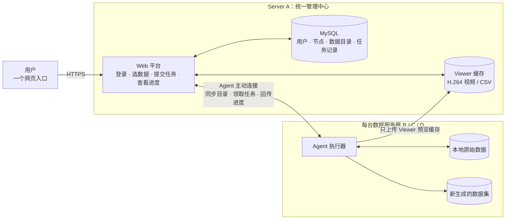

# 多服务器统一数据平台当前情况说明

> 更新时间：2026-09-03  
> 文档定位：说明当前多服务器统一数据平台已经具备的能力、实现方式、优势、限制和下一步基础建设计划。  
> 详细安装与运维步骤见 [分布式部署说明](distributed_data_platform_deployment.md)。

## 一、整体结论

目前多服务器统一数据平台已经完成从 0 到 1 的基础闭环，可以概括为：

> **统一管理、分散存储、就地计算。**

Server A 提供统一网页入口，负责用户权限、服务器节点、数据目录和任务状态管理。Server B、
Server C 等数据服务器继续保存各自的原始数据，并通过本机 Agent 接收和执行任务。

因此，平台统一的是管理入口和操作方式，而不是把所有服务器的磁盘合并，也不是把所有原始数据
集中复制到 Server A。

## 二、当前整体架构



这套架构的核心原则是：

- 用户只访问 Server A，不需要逐台登录数据服务器。
- 原始数据仍然保存在 Server B、Server C 等原位置。
- Agent 在数据所在服务器本地执行处理，避免跨网络读取大规模原始数据。
- 跨服务器主要传输数据摘要、任务参数、进度、结果和 Viewer 预览缓存。

## 三、当前已经实现的功能

| 功能 | 当前实现情况 |
| --- | --- |
| 统一入口 | 用户通过 Server A 的一个网页访问平台，不需要记忆不同服务器地址 |
| 账号与权限 | 支持 `viewer`、`operator`、`admin` 三种角色以及管理员审批 |
| 节点接入 | 每台数据服务器安装一个 Agent，通过独立节点令牌接入 Server A |
| 节点状态 | Agent 定期发送心跳，上报系统信息、磁盘空间和支持的操作 |
| 数据发现 | Agent 扫描限定目录并上报数据路径、episode 数、帧数和特征摘要 |
| 统一数据选择 | Working dataset 可直接切换 Server A 或任一 Agent 数据集，并在刷新后恢复 |
| 远程 Viewer | Agent 本地生成 H.264/CSV 预览缓存；Standardize 输出会自动生成、上传并绑定 Viewer |
| 远程预处理 | 支持标准化、动作维度转换、v3 转换、字段删除、平滑、Split 和 Value Edit |
| 任务中心 | Jobs 与 Pipeline Runs 统一展示状态、服务器、进度、耗时、日志、结果摘要和输出数据集 |
| 衍生数据登记 | 可使用安全默认路径或 writable roots 内的自定义路径，并自动登记新位置 |
| 管理员原地修改 | 可选支持 episode 删除、v3 时间戳修复和原地 Value Edit |
| 安全部署 | 提供 Server A 和 Agent 的 systemd 服务、Agent 安装包和更新脚本 |

## 四、一次远程任务如何运行

```text
用户在网页点击运行
        ↓
Server A 将任务写入 MySQL，状态为 queued
        ↓
对应服务器的 Agent 主动领取任务
        ↓
Agent 在本机读取和处理数据
        ↓
Agent 持续回传进度、日志和任务心跳
        ↓
完成后登记结果、新的数据位置及可用的 Viewer cache
        ↓
Server A 在统一的 Runs 页面展示结果
```

Server A 主要负责“下单和记账”，Agent 负责“实际干活”。数据处理复用了原有 Data Platform
的 `run_precompute` 和 `run_preprocess_op`，没有为远程场景重新实现一套不同的处理逻辑。

## 五、Viewer 的处理方式

浏览器不能直接读取远程数据服务器上的本地文件，因此当前采用以下方式：

1. Agent 在数据所在服务器生成适合网页查看的 H.264 视频和 CSV。
2. Agent 将这些只读 Viewer 缓存上传到 Server A。
3. Server A 登记对应的 Viewer 地址。
4. 用户从统一网页打开 Viewer。

上传的是网页预览缓存，不是整套原始 Parquet 和原始视频。原始数据依然保留在数据服务器上。

## 六、网络方式的简单说明

- 浏览器通过 HTTPS 访问 Server A。
- Nginx 负责 HTTPS 和反向代理，Gunicorn/Flask 提供平台业务接口。
- Agent 主动连接 Server A，完成注册、心跳、目录同步、任务领取和状态回传。
- 用户浏览器不需要直接访问 Server B、Server C。
- 当前部署在网络不能直接连通的节点上使用反向 SSH 隧道；它只负责打通 Agent 到 Server A
  的 HTTPS 通道，不改变平台的任务处理逻辑。

## 七、当前安全保护

- `viewer` 只能查看，不能发起修改任务。
- `operator` 可以运行允许的 Viewer 和衍生预处理任务，但不能原地修改数据。
- `admin` 才可能使用原地修改，并且中央服务和 Agent 两边都必须显式开启。
- Agent 只能读取 `allowed roots`，只能在 `writable roots` 下创建结果。
- 普通远程预处理允许 writable roots 内的自定义绝对输出路径，但 Agent 会再次解析并校验真实路径。
- 输出路径不能等于源数据集，也不能是源数据集的父目录或子目录；`in_place` 仍由管理员开关保护。
- 除明确勾选 Standardize 或 Convert v3 覆盖外，衍生处理默认不覆盖已有输出。
- 原地修改需要二次确认、操作原因和审计记录。
- 真实原地写入前会创建持久备份；失败时自动恢复。
- 源数据修改成功后，Server A 会使旧 Viewer 缓存失效，避免继续展示旧内容。

## 八、当前方案的优势

### 1. 不需要集中搬运原始数据

大规模数据继续保存在原服务器，减少网络传输和重复磁盘占用。

### 2. 数据处理效率更合理

任务在数据旁边执行，主要读取本地磁盘，比跨服务器反复读取大文件更稳定。

### 3. 用户操作更简单

用户只面对一个入口和一套表单，不需要学习不同服务器的登录和运行命令。

### 4. 权限和任务记录统一

账号、角色、数据位置、任务状态、日志和结果由 Server A 统一保存和展示。

### 5. 容易增加新服务器

新增服务器主要是安装 Agent、配置可读和可写目录，不需要再部署一套独立网页平台。

### 6. 默认保护原始数据

普通任务生成兄弟数据集；高风险操作必须经过多层开关、确认、备份和审计。

## 九、当前不足和边界

### 1. 统一的是管理，不是存储

平台目前知道数据位于哪台服务器和哪个路径，但还没有把多台服务器变成一套共享文件系统。

### 2. 数据副本关系还不完善

目前主要按节点和路径登记数据位置，还不能自动确认不同服务器上的两份数据是否完全相同，
也没有完整的内容级去重和副本一致性检查。

### 3. Viewer 缓存依赖 Server A

当前没有接入 OSS/S3/MinIO，远程视频和 CSV 缓存会占用 Server A 的网络和磁盘空间。

### 4. 远程功能还没有完全覆盖本地功能

当前重点覆盖 Viewer、常用预处理和少量管理员原地操作。Curation、Embedding、Compare 和完整
Lifecycle Materialize 等能力还没有全部远程化。

### 5. 任务调度能力仍然基础

当前 Agent 主要串行领取任务，还缺少完整的取消、自动重试、优先级、节点资源调度和并发控制。

### 6. 中央服务还没有完成高可用

当前建议只运行一个 Gunicorn worker，因为部分原有本地状态仍保存在进程内。Server A、MySQL
或网络不可用时，统一入口和状态回传会受到影响。

### 7. 运维组件有所增加

需要同时维护 Server A、MySQL、Nginx、HTTPS 证书、各节点 Agent、目录权限和必要的 SSH 隧道。

## 十、下一步基础建设计划

目前不需要重新设计整体架构，下一步重点是把已经跑通的链路做稳定。

### 第一步：稳定并正式发布现有版本

- 完成代码评审、提交和版本发布。
- 统一 Server A、Agent 的安装、升级和回滚流程。
- 补充节点掉线、网络中断、任务回传失败和服务重启测试。
- 增加节点离线、磁盘不足和任务失败的基础告警。

### 第二步：完善统一数据目录

- 为数据增加内容指纹和明确的版本标识。
- 识别不同服务器上的相同数据和数据副本。
- 记录原始数据、衍生数据及其来源关系。
- 检查副本是否被修改、是否仍然可用。

### 第三步：完善远程任务可靠性

- 支持任务取消、超时和失败重试。
- 控制每台服务器的任务并发数。
- 保证 Agent 重启或网络恢复后任务能够安全继续或重新执行。
- 进一步避免同一任务产生重复输出或重复修改数据。

### 第四步：优化 Viewer 文件存储

- 接入 OSS、S3 或 MinIO 等对象存储。
- 将远程 Viewer 缓存从 Server A 本地磁盘逐步迁出。
- 增加缓存有效期、自动清理和空间限制。

整体推进顺序为：

```text
稳定和发布现有版本
        ↓
完善数据指纹、版本和副本关系
        ↓
补齐任务取消、重试、并发和恢复
        ↓
接入对象存储并支持更大规模使用
```

## 十一、当前成熟度判断

当前已经具备可以演示和试运行的基础能力，核心控制面和 Agent 测试已经覆盖节点注册、心跳、
数据发现、任务领取、进度回传、Viewer 上传、衍生处理和源数据保护等流程。

当前阶段更适合描述为：

> **基础链路已经跑通，正在从“基本可用”向“稳定、可信、可长期维护”完善。**

在正式对外宣布生产可用前，还需要完成代码收口、部署标准化、异常恢复验证、数据副本识别和
任务可靠性建设。

## 十二、汇报口径

可以在汇报中这样介绍：

> 多服务器统一数据平台采用中央控制面加节点 Agent 的架构。Server A 负责统一网页、用户权限、
> 数据目录和任务状态，各数据服务器保留自己的原始数据，并由本机 Agent 执行处理。当前已经完成
> 节点接入、数据发现、远程 Viewer、常用预处理、任务进度回传和数据安全保护，形成了基本闭环。
> 下一步主要完善版本发布、数据指纹和副本关系、任务异常恢复以及 Viewer 对象存储，使平台从
> 基本可用逐步达到稳定、可信、可长期运行的状态。

## 十三、主要实现位置

| 模块 | 作用 |
| --- | --- |
| [`control_plane.py`](../lerobot/data_platform/control_plane.py) | 用户、节点、数据位置、任务和事件的持久化 |
| [`routes/control_plane.py`](../lerobot/data_platform/routes/control_plane.py) | 登录、Agent、节点、数据位置和任务 API |
| [`agent.py`](../lerobot/data_platform/agent.py) | 数据发现、心跳、任务领取、本地执行和结果回传 |
| [`viewer.py`](../lerobot/data_platform/viewer.py) | 将中央控制面接入现有 Data Platform |
| [`visualize_dataset_homepage.html`](../lerobot/data_platform/templates/visualize_dataset_homepage.html) | 多服务器选择和远程任务界面 |
| [`wsgi.py`](../lerobot/data_platform/wsgi.py) | Server A 的 Gunicorn 应用入口 |
| [`deploy/data-platform`](../deploy/data-platform/) | Server A、Agent、Nginx 和更新部署文件 |
